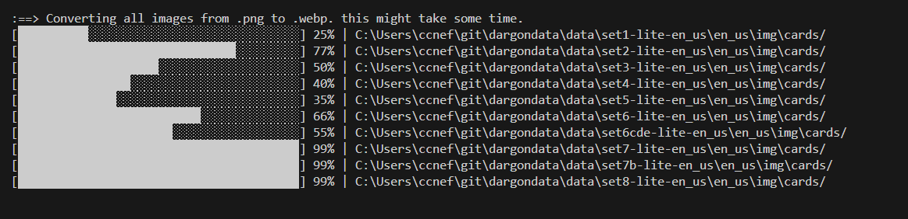

# DARGONDATA

It's a Legends of Runeterra card data and image downloader, zip extractor and image compressor.

It allows me to easily keep the data for my Runeterra utilities updated with some automation.

## phases

- downloads card sets using the set bundles specified on https://developer.riotgames.com/docs/lor#data-dragon_set-bundles
- extracts the zips
- converts images to webp using cwebp
- remove old images



## usage

```
npm i
npm run download
```

## cwebp

this uses cwebp to convert png to webp, although it's added as a dependency, you may have to install it globally.

download
https://developers.google.com/speed/webp/download

docs:
https://developers.google.com/speed/webp/docs/cwebp


